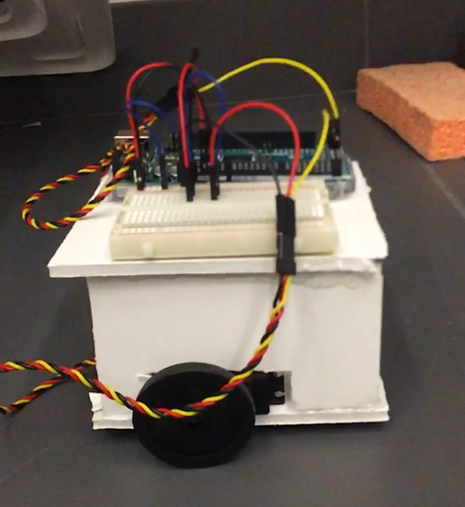

# Week 1

## The Problem
For the first week of the competition, our goal was to complete the initial milestone. That is, we wanted to get our robot to start in the center of one of the quadrants and exit the quadrant. To complete this task, we needed to do the following:
* Design and create circuits for our two servo motors to interface with the Arduino microcontroller
* Adapt/design code to control the speed of the servos and the direction they spin
* Create a body to house the Arduino, breadboard, servos, and battery

## Getting Started
Our first objective was to connect the servo motors to the Arduino...

## Code
Once the wiring was completed, the focus shifted to programming the movement of the servos. The code we used was adapted from the following [source.](https://www.allaboutcircuits.com/projects/servo-motor-control-with-an-arduino/) For our purposes, we needed an additional servo object (since we have two) along with a call to the Arduino Servo library in order to use servo-specific functions. For the milestone, constant motor movement is preferable, so that was altered as well, as shown below. Here is a snippet of code showing how the servos are accessed and controlled:
```c++
void setup()
{
  servo_test_1.attach(44); // attach the signal pin of servo to pin44
  servo_test_2.attach(45); // attach the signal pin of servo to pin45
}

void loop()
{                          
    servo_test_1.write(45); //command to rotate the servo to the specified angle
    servo_test_2.write(180);
}
```
The attach function attaches each servo to a pin, allowing for the servos to communicate with the board. After attaching both servos to their respective assigned pin numbers, we call the write function to rotate each servo to a desired angle. This ballistic style of design is intended to complete the milestone by having each servo spin in a way that gets our robot out of the quadrant. In the coming weeks, a more reactive approach to changing motor speeds will likely be more desirable, as the servos can be fine tuned in regards to environmental situations through the use of sensors.

## Designing the Body
With the Arduino and servos communicating, it was time to craft a body to house the equipment and traverse the playing field...


## Pictures


")


Need to finish writing about circuit, code, and body, along with adding more pictures and acknowledgments.
