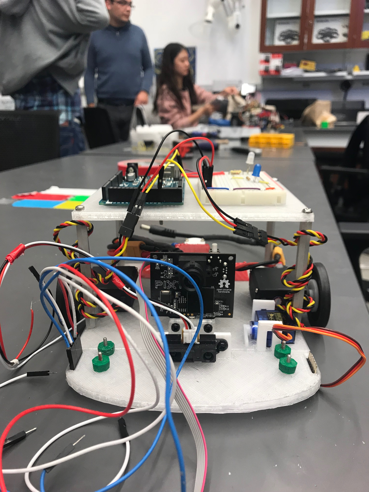
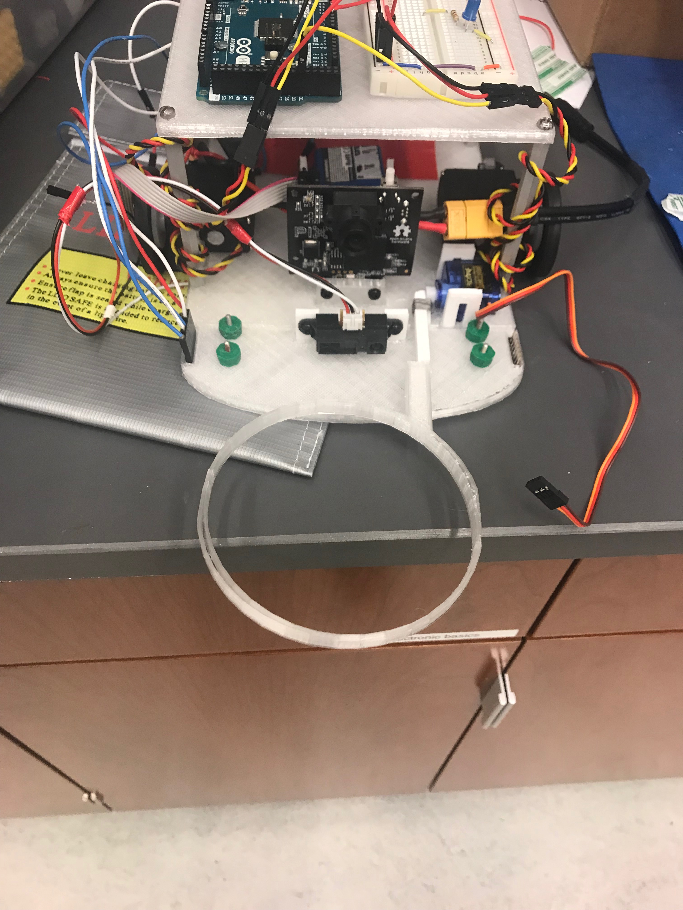

# Week 11
## Goals
For this week, our objectives were the following:
* Find a way for the robot to use the left and right RGB sensors to enter a quadrant perpendicular to the border.
* Print a new catching loop for the robot.
* Get the new loop to drop at the right time in order to secure blocks.
* Get all of the separate behaviors (detect_quadrant_left/right, sense blocks, border_left/right) working together in one loop.

## Entering a quadrant
This week we developed a way to get our robot to enter quadrants at a right angle, so that we know what angle to turn to exit the quadrant. This was accomplished through the following code:

```c++
void straighten_left() {
  while ((detect_quadrant_left() > 0) && (detect_quadrant_right() == 0)) {
    servo_test_1.write(90);
    servo_test_2.write(135);
    delay(100);
  }
}

void straighten_right() {
  while ((detect_quadrant_left() == 0) && (detect_quadrant_right() > 0)) {
    servo_test_1.write(45);
    servo_test_2.write(90);
    delay(5);
  }
}
```
In each of these functions, once the respective RGB sensor detects a quadrant border, the servo on that side is stopped, while the servo on the opposite side continues driving. After the delay, the robot is positioned to enter the quadrant at 90 degrees. One issue with this method is that the amount of time the robot needs to rotate depends on the angle at which it approaches the border. This means delaying for a static amount of time will only work for a small subset of approach angles. Moving forward we may edit this function to rotate until both RGB sensors detect the border of interest, allowing it to work for any angle. 

## Printing a new loop

## Using the loop
The new loop was put into action this week by creating 2 new functions drop_lasso() and lift_lasso():

```c++
void drop_lasso() {
  micro_serve.write(0);
}

void lift_lasso() {
  micro_serve.write(90);
}
```
Drop_lasso writes the micro servo that controls the loop to 0 degrees, extending it straight out in front of the robot. This is the function we would call to catch a block.
lift_lasso writes the micro servo to 90 degrees, lifting the loop upright beside the pixycam. This function would be called to release a block that has been captured. We put these two functions in multiple places in our existing code. For example, it is used to release a block of the target color in the home quadrant:

```c++
void drive_home() {
  while (current_color != target_color) {
    drive();
    border_left();
    border_right();
    straighten_left();
    straighten_right();
  }
  delay(1000);
  kill_servos();
  lift_lasso();
}
```
The drive_home() function drives the robot around until it has reached the home qudrant, stops the servos via the function kill_servos(), and lifts the lasso to release the block.

## Putting things together
We also started working on getting all of the behaviors we've developed separately integrated into one loop. This has been more difficult than anticipated, because the functions that worked independently do not all work when put into one loop. We worked towards solving this problem by adding in separate functions one at a time, as shown in the following code:

```c++
void loop() {
  drive();
//  detect_quadrant_left();
//  detect_quadrant_right();
//  if ((detect_quadrant_left() > 0) && (detect_quadrant_right() == 0)) {
//    straighten_left();
//    delay(1000);
//  }
//  else if ((detect_quadrant_left() == 0) && (detect_quadrant_right() > 0)) {
//    straighten_right();
//    delay(1000);
//  }
//
//
//  border_left();
//  border_right();
  int front_sensor_val = analogRead(IR_FRONT);
  sense_blocks(front_sensor_val);

}
```
In this loop, everything is commented out except the drive and sense_blocks functions. Next week we will try to get all of our separate functions working in the loop.


## Next Steps
For the upcoming week, our focus is on continuing to get all of our code working together consistently, and to fine tune our block catching mechanism to work consistently. 

## Pictures
|
|:--:|
| *Front View* |
|
| *Top-down view* |
|
| *Side View* |
|
| *Front Mechanism* |

## Acknowledgments
Amy and Frank worked on the programming-based objectives for the week. John designed and printed the loop that we are currently using.
