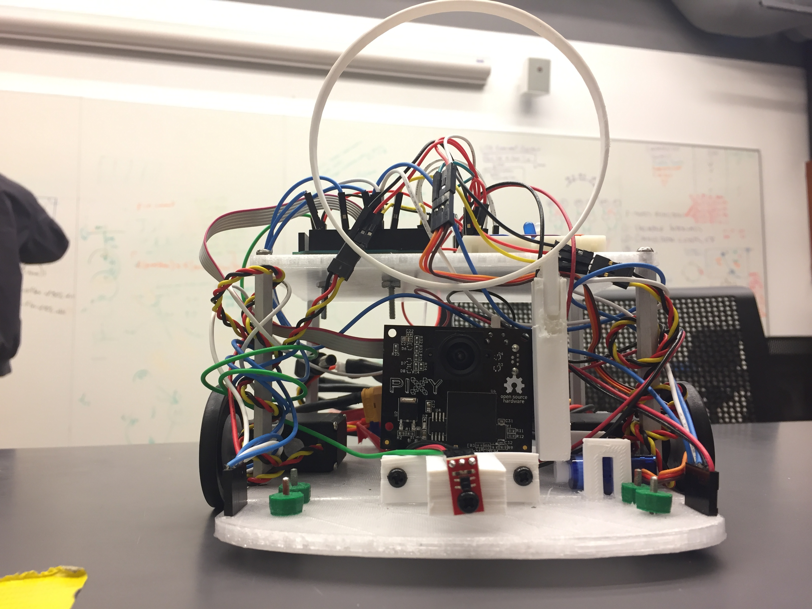
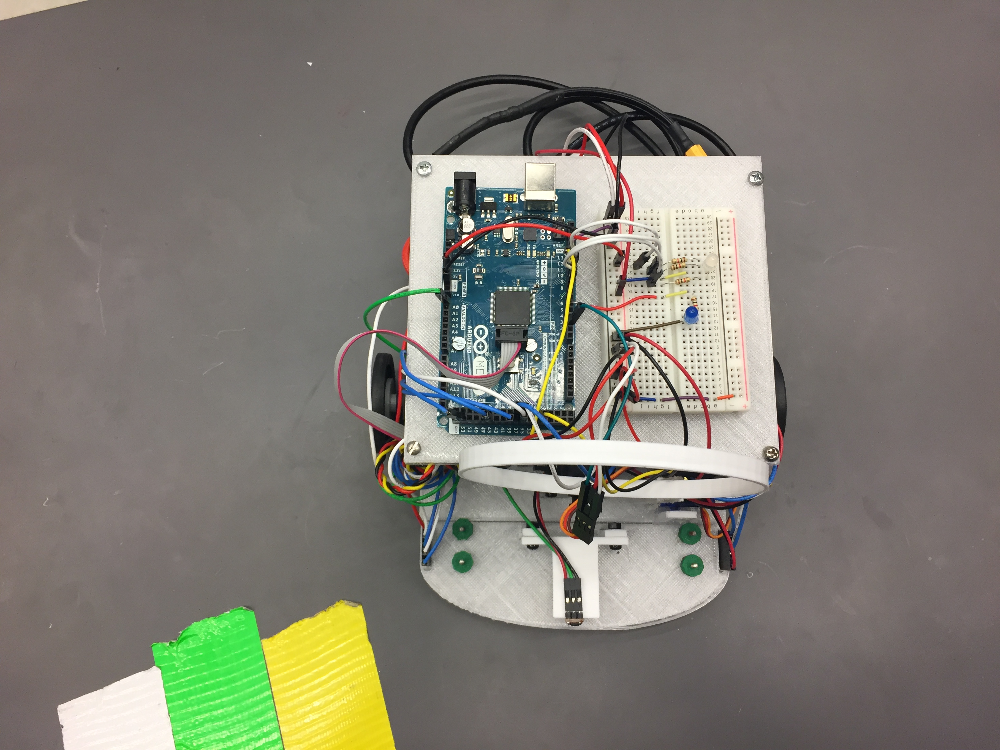
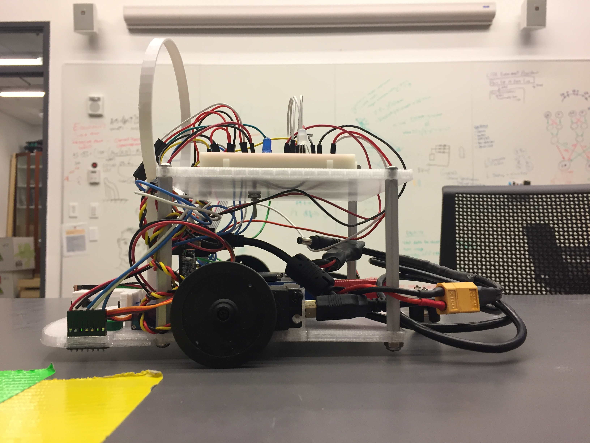

# Week 12
## Goals
For this week, we wanted to complete the following:
* Get detect_quadrant_left/right() and sense_blocks() methods to work together
* Straighten robot entry into quadrants


## Getting Everything Working Together
A problem that has been continually impacting progress on the robot was that our code would only work in small pieces. However, for the final competition, we need all of the code to interact together. To do this, we cleaned up our code to only include the most essential features. Doing so worked and allowed us to focus our attention on other pressing issues. Three of the main functions are shown below:


```c++
int detect_quadrant_left() {
  //getting values from left RGB sensor
  uint16_t clear, red, green, blue, colorTemp, lux;
  tcs1.getRawData(&red, &green, &blue, &clear);
  lux = tcs1.calculateLux(red, green, blue);
  //when lux is above 3000, the sensor is on the tape
  if (lux > 3000) {
    //yellow tape conditions
    if ((red > blue) && (green > blue) && ((red - blue) > 1000)) {
      //set the RGB LED to yellow
      //change state to yellow
      if (target_color == 0) {
        target_color = YELLOW_Q;
        setColor(0, 255, 0);
      }
      current_color = YELLOW_Q;
      return current_color;
    }
    //white tape conditions
    else if ((red > 6000) && (blue > 8000) && (green > 9000)) {
      // back up, wait, then rotate
      reverse();
      delay(1000);
      rotate();
      delay(1000);
      return 0;
    }
    //green tape conditions
    else if ((green > red) && (green > blue)) {
      //set the RGB LED to green
      setColor(0, 255, 0);
      //change state to green
      if (target_color == 0) {
        target_color = GREEN_Q;
      }
      current_color = GREEN_Q;
      return current_color;
    }
    //red tape conditions
    else if ((red > green) && (red > blue)) {
      //set the RGB LED to red
      setColor(255, 0, 0);
      //change state to red
      if (target_color == 0) {
        target_color = RED_Q;
      }
      current_color = RED_Q;
      return current_color;
    }
    //blue tape conditions
    else if ((blue > green) && (blue > red)) {
      //set the RGB LED to blue
      setColor(0, 0, 255);
      //change state to blue
      if (target_color == 0) {
        target_color = BLUE_Q;
      }
    }
    else {
      return 0;
    }
  }
  else {
    return 0;
  }
}


int detect_quadrant_right() {
  //getting values from left RGB sensor
  uint16_t clear, red, green, blue, colorTemp, lux;
  tcs2.getRawData(&red, &green, &blue, &clear);
  lux = tcs2.calculateLux(red, green, blue);
  //when lux is above 3000, the sensor is on the tape
  if (lux > 3000) {
    //yellow tape conditions
    if ((red > blue) && (green > blue) && ((red - blue) > 1000)) {
      //set the RGB LED to yellow
      setColor(255, 50, 0);
      //change state to yellow
      if (target_color == 0) {
        target_color = YELLOW_Q;
      }
      current_color = YELLOW_Q;
      return current_color;
    }
    //white tape conditions
    else if ((red > 6000) && (blue > 8000) && (green > 9000)) {
      // back up, wait, then rotate
      reverse();
      delay(1000);
      rotate();
      delay(1000);
      return 0;
    }
    //green tape conditions
    else if ((green > red) && (green > blue)) {
      //set the RGB LED to green
      setColor(0, 255, 0);
      //change state to green
      if (target_color == 0) {
        target_color = GREEN_Q;
      }
      current_color = GREEN_Q;
      return current_color;
    }
    //red tape conditions
    else if ((red > green) && (red > blue)) {
      //set the RGB LED to red
      setColor(255, 0, 0);
      //change state to red
      if (target_color == 0) {
        target_color = RED_Q;
      }
      current_color = RED_Q;
      return current_color;
    }
    //blue tape conditions
    else if ((blue > green) && (blue > red)) {
      //set the RGB LED to blue
      setColor(0, 0, 255);
      //change state to blue
      if (target_color == 0) {
        target_color = BLUE_Q;
      }
    }
    else {
      return 0;
    }
  }
  else {
    return 0;
  }
}

void sense_blocks(int front_sensor_val) {
  //initialize variable to store number of objects Pixycam sees

  int num_blocks = pixy.getBlocks();
  //get left RGB sensor values (temporary)
  uint16_t clear, red, green, blue, lux;
  tcs1.getRawData(&red, &green, &blue, &clear);
  lux = tcs1.calculateLux(red, green, blue);
  /*check each object detected by pixycam to see if it
     matches thae target color (and robot is not out of bounds)
  */

  Serial.println(front_sensor_val);
  for (int i = 0; i < num_blocks; i++) {
    if ((pixy.blocks[i].signature == target_color)) { //&& !((red > 9000) || (blue > 9000) || (green > 9000) || (lux > 3000))) {
      //Serial.println("Found a block/Not on white tape");
      //signal that a block matching target color was found
      //signal_block();
      //if object is to the left, turn left
      if (pixy.blocks[i].x < 130) {
        servo_test_1.write(45);
        servo_test_2.write(110);
        delay(50);
      }
      //if object is in central view, drive straight
      else if ((pixy.blocks[i].x >= 130) && (pixy.blocks[i].x <= 160)) {
        servo_test_1.write(45);
        servo_test_2.write(135);
        delay(50);
      }
      //if object is to the right, turn right
      else if (pixy.blocks[i].x > 160) {
        servo_test_1.write(70);
        servo_test_2.write(135);
        delay(50);
      }
    }
    //if there are no blocks matching the target color, stop (temporary)
  }

    if (front_sensor_val < BLOCK) {
      has_block = true;
      drop_lasso();
      //drive_home();
    }
}

```
When this code is run, detect_quadrant_left/right() set the target_color (home quadrant) and current_color (current quadrant) to their respective values and sense_blocks() uses that information to find blocks that match the target_color.

## Straightening the Loop
We want our robot to enter each quadrant as straight as possible in order to make modeling the environment easier since having more precise movement allows us to hard-code turning movements based on which quadrant we are in and where we want to go.

```c++
 if ((detect_quadrant_left() > 0) && (detect_quadrant_right() == 0)) {
    straighten_left();
  }
  else if ((detect_quadrant_left() == 0) && (detect_quadrant_right() > 0)) {
    straighten_right();
  }
```
 
If we are entering a quadrant at an angle, the robot will correct itself to get both RGB sensors on the same surface, effectively straightening the robot.

## Next Steps
In the week before the competition, we would like to have our robot return a block to the starting quadrant once it is captured. To do this, we need to include some logic in the code that changes behavior depending on if we have a block or not. A basic model of the environment will likely be designed as a way to accurately return home.

## Pictures
|
|:--:|
| *Front View* |
|
| *Top-down view* |
|
| *Side View* |


## Acknowledgments
Amy, Frank, and John worked on the programming-based objectives for the week.
