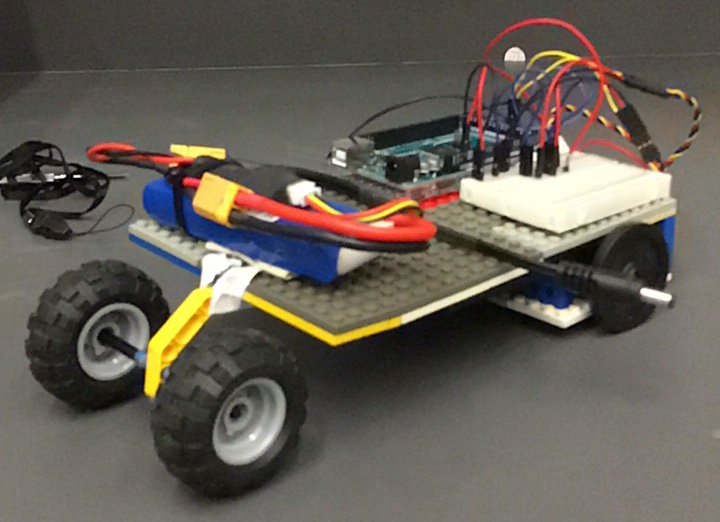
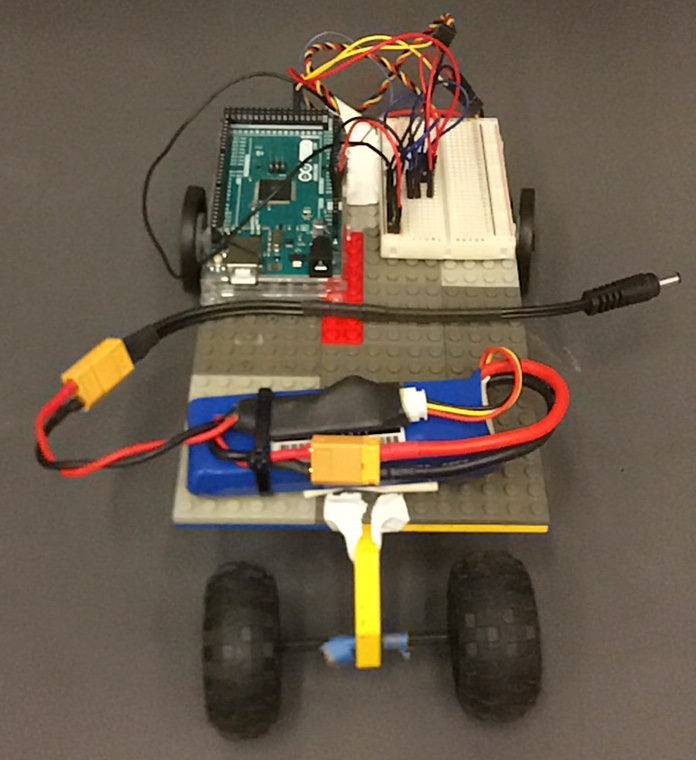
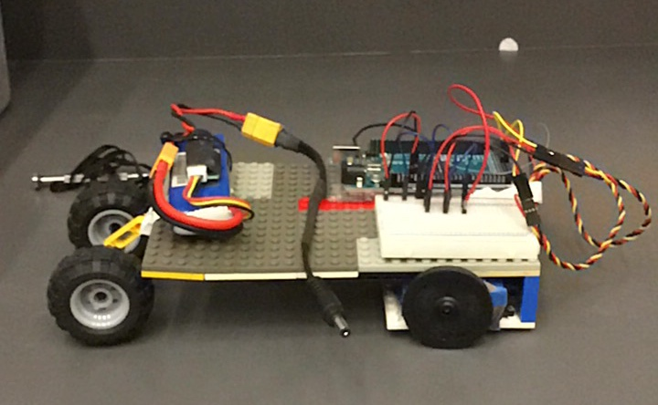
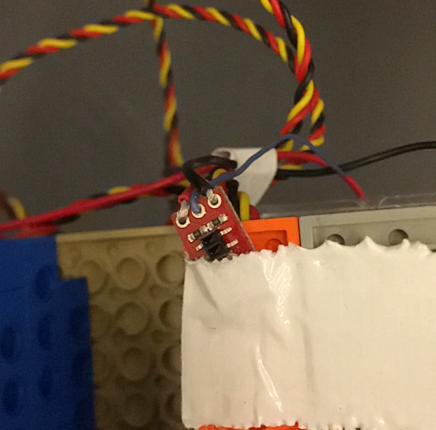

# Week 2

## Goals
For the second week of the competition, we wanted to complete the next milestone (or get as close as possible). Specifically, our goal was to get our robot to start in the center of one of the quadrants, move toward the edge of the playing field, sense the white tape marking the boundary, move backward, and stop. The first part of this goal was already completed during week 1. To finish the remaining parts of our objective, the following was required:
* Attach an Analog IR reflectance sensor from the Arduino to the bottom of the robot to measure different values of IR light coming from the playing field (gray surface vs. white boundary tape)
* Program the Arduino to communicate with the IR sensor. In particular, we needed to find a way to differentiate between the playing field and boundary using sensor values and use such values to enter a new state when the edge of the field was reached.

As a secondary objective, we designed a new body for our robot in hopes of increased stability and space for future components like the Pixycam.

## Attaching the IR Sensor
A simple way to mark the difference between light and dark colors is with the use of an IR reflectance sensor. The sensor measures the reflective value of the surface it is placed over and returns a value between 0 and 1023. Values closer to 0 are more reflective (white). Before being attached to our robot, the wires that connect the IR sensor to the Arduino needed to be soldered. The sensor needs a voltage, ground, and analog input connection to function. Once soldered, the sensor was fastened to the bottom of the robot using masking tape. In the future, when a 3D printable body for our robot is being designed, a dedicated slot to hold the IR sensor will be included.

## Code
Expanding on our prior code, we wanted to make servo movements dependent on the value of the IR sensor. To communicate with the IR sensor, we used the analogRead method. This method takes in the value of the analog port the sensor is connected to and returns the value read by the sensor. To see what these values actually are, we printed the sensor values to the serial monitor. This allowed us to determine the threshold between white tape and dark playing surface in terms of sensor readings. To demonstrate how sensor values are implemented in changing the direction of the servos, consider the following code snippet:
```c++
void loop()
{

  int sensor_val = analogRead(IR); //IR is the analog port value (A0)
  Serial.println(sensor_val);

  while ((sensor_val >= 80) && (state == 0)) {
    servo_test_1.write(45); //command to rotate the servo to the specified angle
    servo_test_2.write(135);
    delay(250);
    return;
  }
  if ((sensor_val < 80) && (state == 0)) {
    servo_test_1.write(135); //go in reverse
    servo_test_2.write(45);
    state = 1;
  }
  if (state == 1) {
    delay(3000);
    servo_test_1.write(90); //stop
    servo_test_2.write(90);
  }
}
```
Initially, the state is set to zero. While the robot is traversing the playing field (starting at the center), it will go straight. If the robot senses the white boundary tape, the direction of the servos will reverse and the state is changed. In this new state, after 3 seconds of reversing, the robot is programmed to stop. There are a few problems with this current code design. The robot gets stuck moving back and forth between the playing field and the boundary line without coming to a stop. There is likely a logical error somewhere within our design that has yet to be determined. Fixing this is a priority, as it is the only issue preventing the completion of the milestone. In the future, a more reactive approach to programming the servo motors will be valued, especially when camera readings for blocks in the playing field require corrections that cannot be hard-coded.

## A New Body
A secondary objective for the week was to redesign the foamcore body from the previous week. We needed additional space for components and took into account some of the weight-balancing issues that impacted the prior design. Instead of foamcore, we used Lego pieces, hoping that they would provide more stability. Unlike the last body, this new frame has only one tier where all of the components are stored. The servo motors are in the front of the robot, along with the Arduino, breadboard, and IR sensor. The weight of these components (hopefully) offsets the battery stored in the back of the body. An extra set
of non-motorized wheels were also added in an attempt to further support the robot's frame. It may be more beneficial to reorient the robot by placing the IR sensor in the 'back' and having the servos operate in the rear of the bot. We need to further test the movement of the robot to determine the extent to which these changes improve our robot and what other changes are needed.

## Pictures
|
|:--:|
| *Our 'New' Robot* |
|
| *Front View* |
|
| *Side View* |
|
| *Closeup of the IR* |

### Acknowledgments
Amy helped with designing the new Lego body and programming the servo and IR functions.
Frank helped with programming and implementing servo motor controls using IR values.
John also assisted in programming along with soldering the IR sensor.
