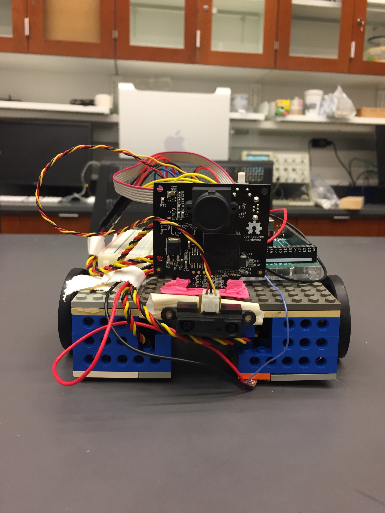

# Week 3

## Goals
Our objectives this week were to finish up the second milestone (get our robot to start in the center of one of the quadrants, move toward the edge of the playing field, sense the white tape marking the boundary, move backward, and stop), and to get started on the third milestone (have our robot to start in a random position, signal when it has found a block, and stop).

## Completing Milestone 2
Initially we came up with a few different code designs to get the robot to approach and detect the white border, back up and stop. Many of these worked when the robot was powered via USB, but stopped working when the robot was changed to battery power. We solved this problem early in week 3 by changing the amount of power applied to each component on the board.

## Setting up the Pixy Cam and LED
Next we set up the Pixy CMUcam5 and "taught" it each of the block colors. We mounted it to the front of the body and intend to use it to find blocks in the field. We also integrated a red LED into our breadboard and wrote some preliminary code to signal when the pixy cam has detected a block.

## Code
The following is our first attempt at using the LED to signal when a block has been detected:
```c++
void loop()
{

  int num_blocks =0;

  digitalWrite(LED_PIN, LOW);   // turns the LED off

  num_blocks = pixy.getBlocks();

  if(num_blocks == 0) {
    servo_test_1.write(45); //command to rotate the servo to the specified angle
    servo_test_2.write(90);
  }

  digitalWrite(LED_PIN, HIGH);   // turns the LED on
  delay(100);
  servo_test_1.write(90); 
  servo_test_2.write(90);
  digitalWrite(LED_PIN, LOW); 
  delay(100);
  digitalWrite(LED_PIN, HIGH);   
}
```
The value num_blocks represents the number of blocks detected by the Pixy Cam, acquired by the Pixy function getBlocks(). If num_blocks = 0, then no blocks have been detected, and the robot should rotate around by spinning one servo in the forward direction. Once a block has been detected, num_blocks should increase, the servos should stop rotating, and the LED should flash, signifying a block has been found.

## Drawbacks
Currently we are having some difficulty difficulty differentiating between blocks and other objects of the same colors within view of the Pixy Cam, namely the quadrant boundaries in the field. We hope to solve this by using an IR proximity sensor in tandem with the Pixy to detect when the blocks are a certain distance from the robot. We attached the IR sensor to the front of the robot, but are not currently able to detect objects at a distance greater than ~4-6 inches.

## Pictures
|
| *Front View* |
|
| *Side View* |
|
| *Closeup of the Pixy Mount* |
|
| *Closeup of the IR* |

## Acknowledgments
Frank and John helped set up the Pixy Cam and teach it the block colors, and wrote the code to light up the LED. Amy used the 3Doodler to build a base to mount the Pixy Cam to the front of the robot. John and Amy also started writing code to use the IR proximity sensor to detect blocks.


