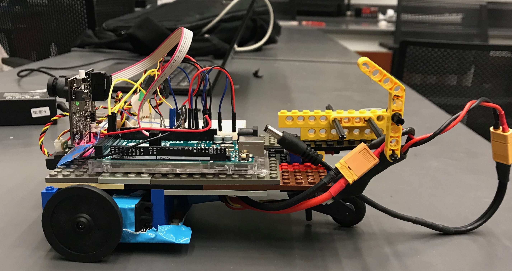
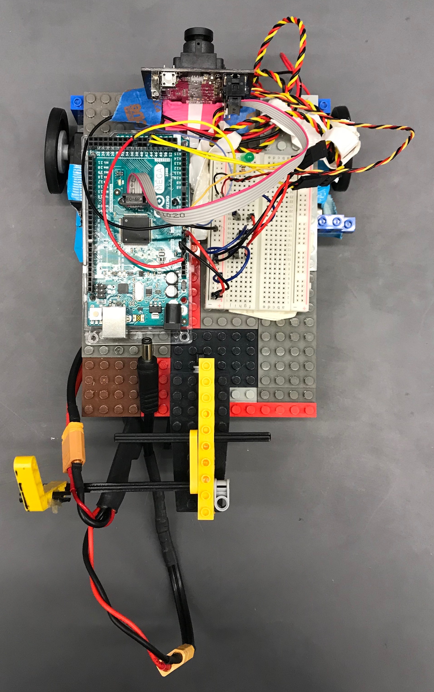
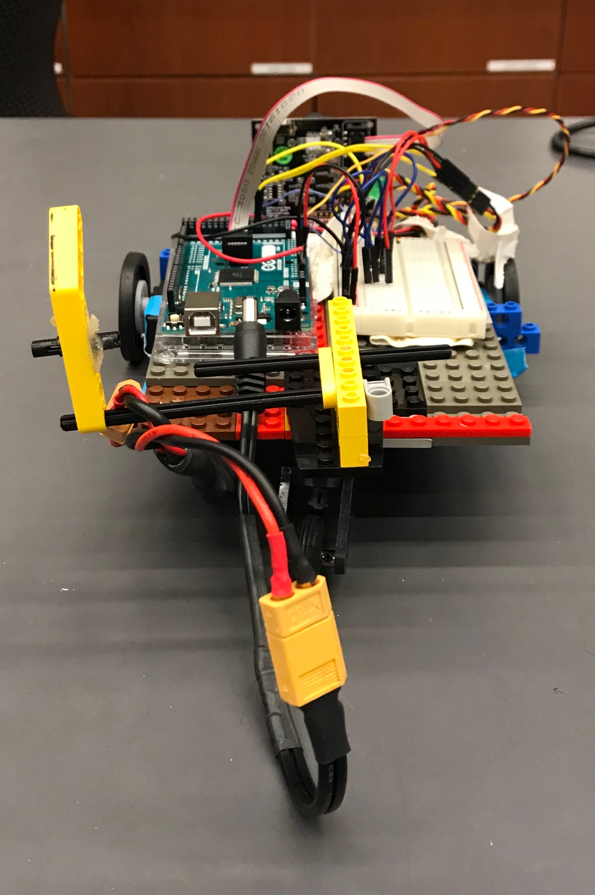

# Week 4

## Goals
Our goal this week was to work on (and hopefully complete) milestone 3 and begin thinking about the broader issues we would need to solve in order to complete the remaining pre-Spring Break milestones.

## To Milestone 3 and Beyond
We wrote code (see Code section) that should enable our robot to complete milestone 3. However, on Tuesday's lab, we were unable to test this code immediately. Our robot, under all its weight, was unable to steer itself properly using the random cruise function we developed. The weight distribution was off, causing our robot to drag in unpredictable and adverse ways. We needed to redesign the chassis if we were to get any closer to completing the third milestone.

## Changes to the Chassis
The battery was located at the rear of our robot. The battery is among the most heavy of components, and with the especially long body we were using, the robot was unable to steer properly. Moreover, our servos were beginning to come loose. So we retaped the servos, shortened the chassis, changed the back wheel configuration to a one-wheel, shopping cart-esque system. Additionally, we added a "tail" to our robot so that the battery wire had something to wrap around, rather than dragging on the floor and creating friction. Finally, we repositioned our battery between our wheels.


## Code
As we made substantial changes to our code, it is added below in its entirety for convenience. 

```{c}
#include <Servo.h> //Servo library
#include <SPI.h>
#include <Pixy.h>

//constant variable declarations
const int SERVO_1 = 44;
const int SERVO_2 = 45;
const int LED_PIN = 38;
const int IR_FRONT = A3;
const int IR_BOTTOM = A0;
const int BORDER = 80;
const int BLOCK = 130;

//initialize two servo objects for the connected servos
Servo servo_test_1;
Servo servo_test_2;

//initialize Pixy cam
Pixy pixy;

void setup()
{
  Serial.begin(9600);

  servo_test_1.attach(SERVO_1); // attach the signal pin of servo to pin44 of arduino
  servo_test_2.attach(SERVO_2); // attach the signal pin of servo to pin45 of arduino
  pinMode(LED_PIN, OUTPUT);

   pixy.init();
}

void rand_cruise(int random_number) {
  //random_number = rand() % 3;
  //int random_number = 2;
  if (random_number == 0) {
    servo_test_1.write(90);
    servo_test_2.write(150);
  }
  else if (random_number == 1) {
    servo_test_1.write(45);
    servo_test_2.write(135);
  }
  else {
    servo_test_1.write(180);
    servo_test_2.write(130);
  }
}

void sense_border(int bottom_sensor_val) {
  if (bottom_sensor_val < BORDER) {
    servo_test_1.write(135); //go in reverse
    servo_test_2.write(45);
    delay(1000);
    servo_test_1.write(45); //turn around
    servo_test_2.write(90);
    delay(1000);
  }
}

void sense_blocks(int front_sensor_val) {
  int num_blocks = pixy.getBlocks();
  Serial.println(num_blocks);
  //int num_blocks = pixy.blocks[].length;
  //int num_blocks = 5;
  if ((front_sensor_val > BLOCK) && (num_blocks >= 1)) {
    Serial.println("Found a block!");
    servo_test_1.write(90);
    servo_test_2.write(90);
    led_on();
    delay(10000);
  }
}

void led_on() {
  digitalWrite(LED_PIN, HIGH);   // turns the LED on
    delay(1000);
    digitalWrite(LED_PIN, LOW);
    delay(1000);
    digitalWrite(LED_PIN, HIGH);
    delay(1000);
    digitalWrite(LED_PIN, LOW);
}

void loop() {
  int bottom_sensor_val = analogRead(IR_BOTTOM);
  int front_sensor_val = analogRead(IR_FRONT);
  //Serial.println(front_sensor_val);
  int random_number = rand() % 3;
  //Serial.println(random_number);
  rand_cruise(random_number);
  delay(500);
  sense_border(bottom_sensor_val);
  sense_blocks(front_sensor_val);
  //delay(300);
}
```
We developed a rand_cruise function that would employ a random number generator to decide which way the robot would steer in the hopes that a random cruise would help our robot find blocks quickly. We also refactored our code (such as led_on and sense_blocks) so that we could call functions instead of having everything in the main loop of the program. To find blocks, our robot would need to get close enough to a block that its IR sensor value would exceed a threshold while also detecting a block in the PixyCam. Once this happens, our robot should stop and its LED should turn on.


## Current Roadblocks

Currently, we're having a small bit of trouble adjusting parameters so that our robot reliably detects blocks. As of Monday morning, our robot is *sometimes* able to find blocks, but other times it has trouble. We believe that this simply requires tuning of the PixyCam signatures and LED threshold value. This issue should be resolved early next lab.

## Pictures
|![Front View] (images/week_4/Front_View.JPG)|
|**Front View**|
||
|**Side View**|
||
|**Top View**|
||
|**View from Behind**|

## Acknowledgements 
Amy and John worked on redesigning the chassis of the robot while Frank wrote the code that would instantiate the agreed-upon behavior. Amy, Frank, and John all helped debug the robot when it was misbehaving. 
