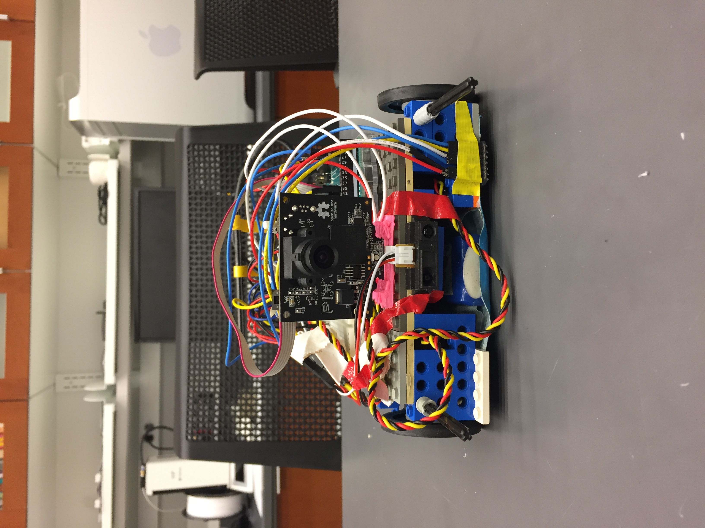
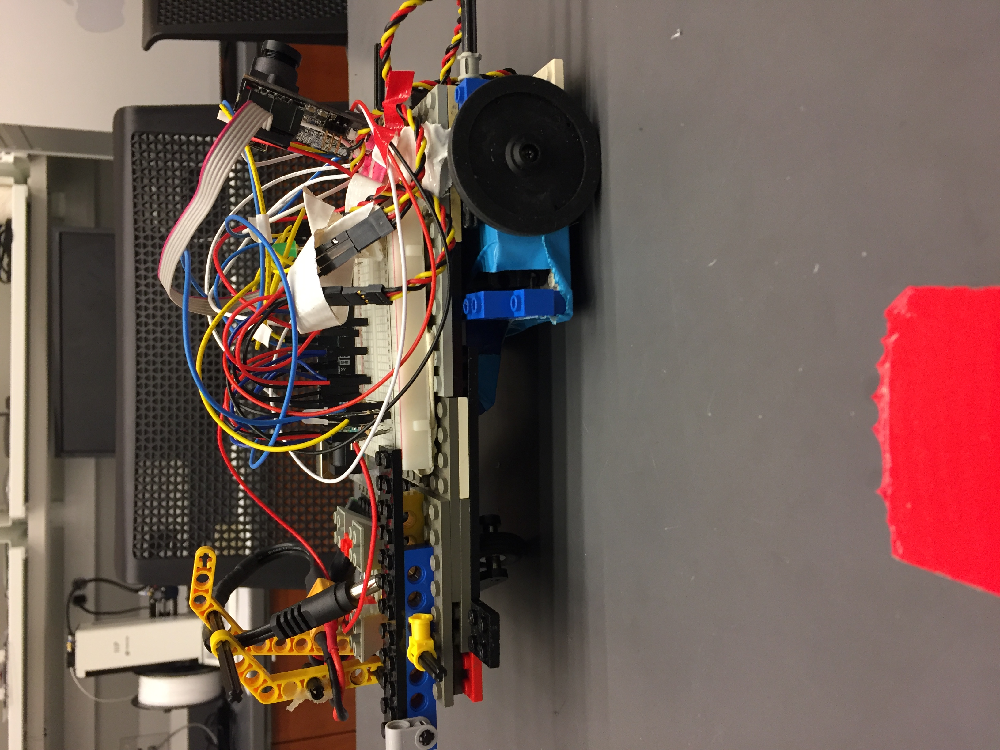
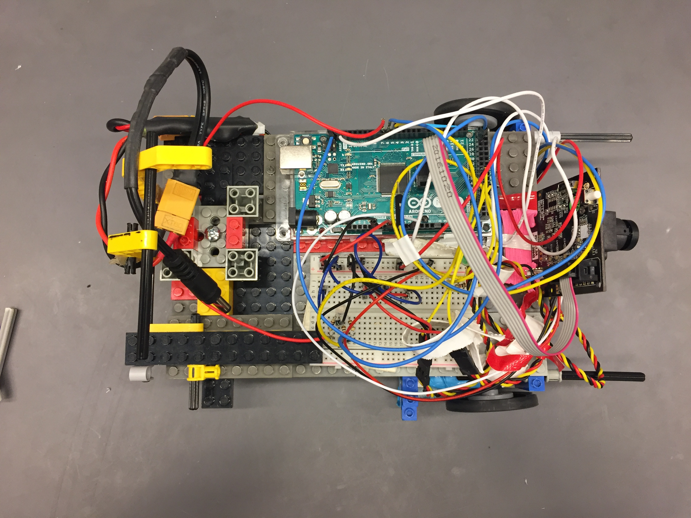
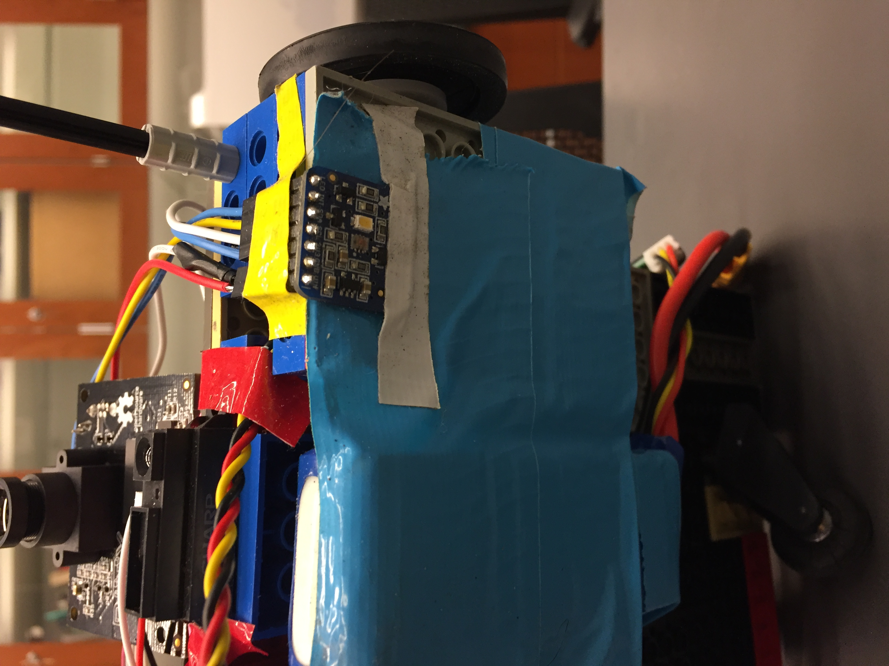
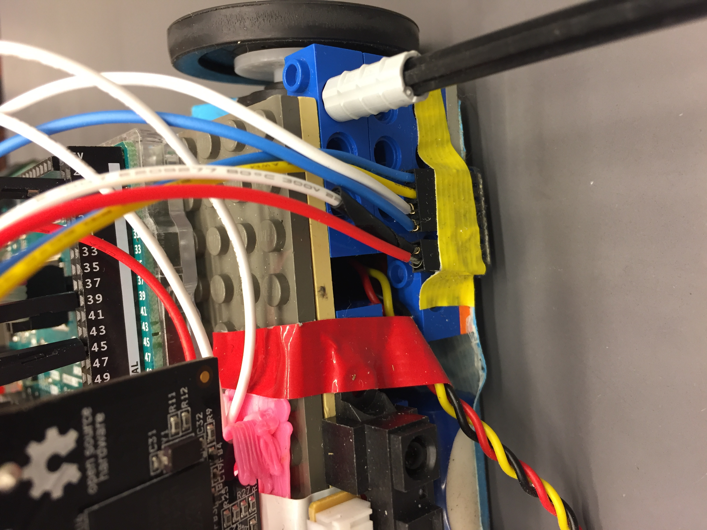
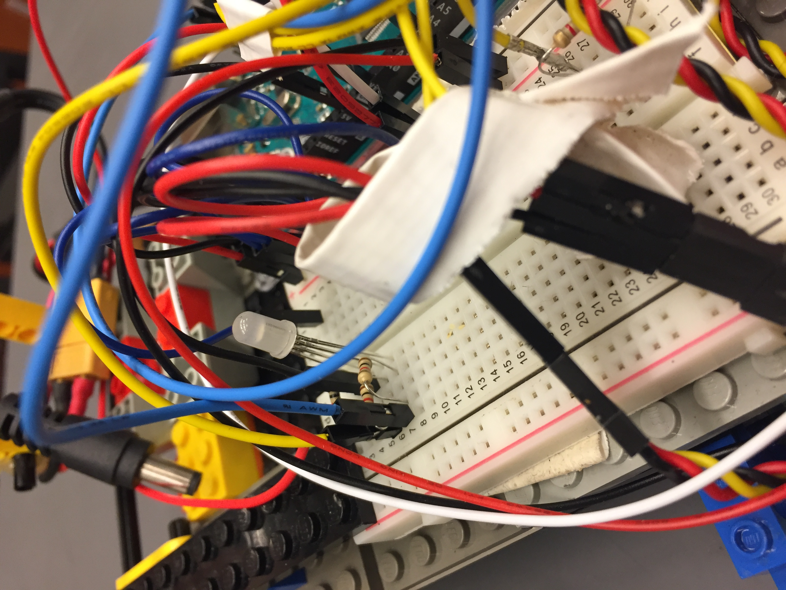

# Week 5

## Goals
This week's goal was to complete milestones 3, 5, and 6. More specifically, we needed to:
* Signal that we found a block on the playing field
* Signal what quadrant we are in
* Drive around the field and signal which quadrant we are in at all times after leaving the starting quadrant

## Milestone 3
To complete the third milestone, we implemented a random cruise function that would steer the robot around the field and (hopefully) in the direction of blocks. Using the PixyCam and an IR distance sensor, we programmed the Arduino to turn an LED on if the camera detected at least one block *and* the sensor values were indicative of being in the presence of a block. This is further illustrated with the following code snippet:

```c++
const int IR_FRONT = A3;
const int BLOCK = 150;

void sense_blocks(int front_sensor_val) {
  int num_blocks = pixy.getBlocks();
  if ((front_sensor_val >= BLOCK) && (num_blocks >= 1)) {
    Serial.println("Found a block!");
    servo_test_1.write(90);
    servo_test_2.write(90);
    led_on();
    delay(2000);
    led_off();
  }
}
```
When the bot found a block, the servos would stop and the LED would turn on for 2 seconds to explicitly indicate that the conditions in the method were true. With this completed, we went on to the fifth milestone.

## Milestone 5 + Milestone 6
Since we needed signal the quadrant we were in at all times, we opted to use an RGB sensor that would read the color values on the playing field, specifically the four different colors of tape corresponding to each quadrant. The RGB sensor was attached to the bottom of the robot, where the IR sensor had previously been. In addition to the RGB sensor, we included an RGB LED that would change depending on the RGB values returned by the sensor. The RGB LED was connected to the breadboard and each leg corresponding to red, blue, and green was connected to one of the Arduino's digital pins. Here is a bit of code that performs most of the described tasks.

```c++
#include <Servo.h> //Servo library
#include <SPI.h> // to communicate with SPI devices
#include <Adafruit_TCS34725.h> // RGB Color Sensor

const int SERVO_1 = 44; //left servo
const int SERVO_2 = 45; //right servo
const int IR_BOTTOM = A0; //bottom IR sensor
const int GREEN_PIN = 5; // Green RGB LED pin
const int BLUE_PIN = 6; // Blue RGB LED pin
const int RED_PIN = 7; // Red RGB LED pin

// Initialize the RGB sensor
Adafruit_TCS34725 tcs = Adafruit_TCS34725();

void setup() {
  Serial.begin(9600);
  servo_test_1.attach(SERVO_1); // attach the signal pin of servo to pin44 of arduino
  servo_test_2.attach(SERVO_2); // attach the signal pin of servo to pin45 of arduino
  // set each pin on the RGB LED to output
  pinMode(BLUE_PIN, OUTPUT);
  pinMode(RED_PIN, OUTPUT);
  pinMode(GREEN_PIN, OUTPUT);
}

void loop() {
// call the drive() and found_color() methods
drive();
found_color();
}

void found_color() {
  uint16_t r, g, b, c, colorTemp, lux;

  // calling tcs methods to access color, lux, and temperature values
  tcs.getRawData(&r, &g, &b, &c);
  colorTemp = tcs.calculateColorTemperature(r, g, b);
  lux = tcs.calculateLux(r, g, b);

  if (lux > 20) {
    //  when lux is above 20, the sensor is on the tape
    if (((r > b) && (g > b) && (r > g)) && (b < 60) && (colorTemp < 4000)) {
      // yellow tape
      setColor(0, 150, 255);
      Serial.println("Found Yellow!");
    } else if (((colorTemp > 8300) && (colorTemp < 8700)) && ((lux > 100) && (lux < 200))) {
      // white tape
      Serial.println("Reversing!");
      // back up, wait, then rotate
      reverse();
      delay(1000);
      rotate();
      delay(2000);
      return;
    } else if (((g > r) && (g > b) && (b > r)) && ((r < 50) && (b < 50)) && (colorTemp < 6000)) {
      // green tape
      setColor(255, 100, 255);
      Serial.println("Found Green!");
    } else if (((r > g) && (r > b)) && ((g < 40) && (b < 40))) {
      // red tape
      setColor(0, 255, 255);
      Serial.println("Found Red!");
    } else if (((b > g) && (b > r)) && ((r < 50) && (g < 100)) && (lux < 60) && (colorTemp > 40000)){
      // blue tape
      setColor(255, 255, 0);
      Serial.println("Found Blue!");
    }
  }
}

void drive() {
  // drive in a "straight" line
  servo_test_1.write(45);
  servo_test_2.write(135);
}

void reverse() {
  // back the robot up
  servo_test_1.write(135);
  servo_test_2.write(45);
}

void rotate() {
  // turn the robot
  servo_test_1.write(45);
  servo_test_2.write(45);
}
```
The bulk of the program's functionality is in the found_color method. This method utilizes some of the methods from the RGB sensor (TCS34725) library to get lux, color temperature, and rgb values. We use the lux value to tell if we are on the playing field or the reflective tape. If we are, then we compare rgb, color temperature, and lux values between different tape types to tell which color tape the robot is on, and therefore which quadrant the robot is in. When the conditions for a certain color is met, the LED changes to that color and remains lit until it crosses a new quadrant, when it changes. To traverse the entire field, we start by going straight (or as straight as possible) from one end of the field to the other, sensing the white border and reversing/turning around, and then continuing straight. This eventually gets us to each quadrant, thus completing the milestone.

## Next Steps
For Week 6, our goal is to complete the final milestone (milestone 4). That is, we want our robot to be able to push blocks out of bounds. To do this, we will combine our ability to sense blocks with new implementation that enables our bot to move blocks around.

## Pictures
|
|:--:|
| **Front View** |
|
|**Side View**|
|
|**Top View**|
|
|**RGB Sensor Bottom View**|
|
|**IR Front View**|
|
|**View of the Breadboard**|

## Videos
[Milestone 3 (part 1)](https://goo.gl/eQqmVm)

[Milestone 3 (part 2)](https://goo.gl/BEWKg9)

[Milestone 5](https://goo.gl/TXcpVX)

[Milestone 6](https://goo.gl/cpNkZH)

## Acknowledgements
Everyone worked on making additions to the robot and designing code to complete each milestone.
