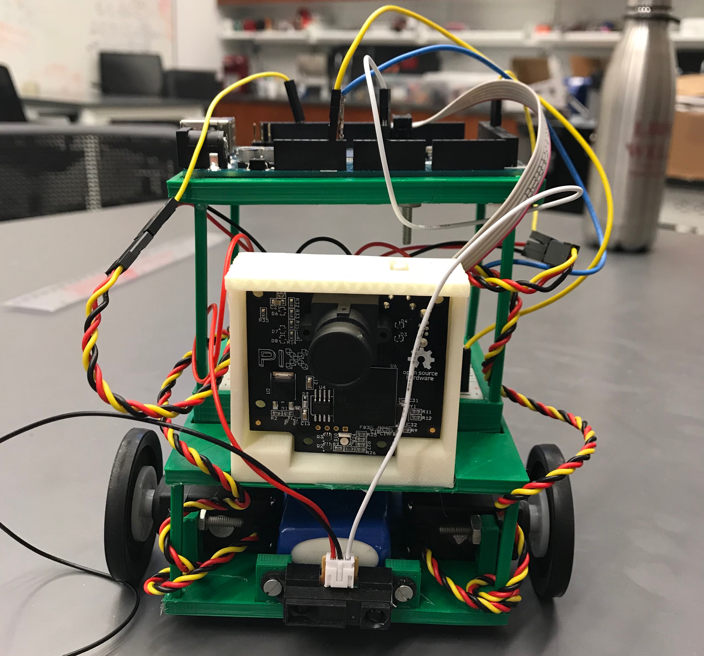
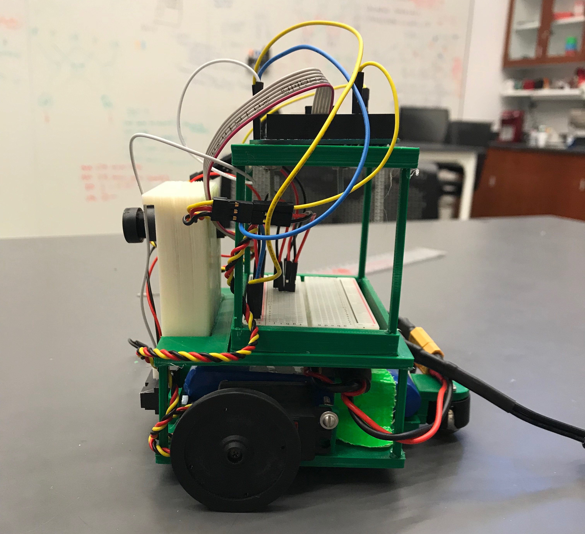
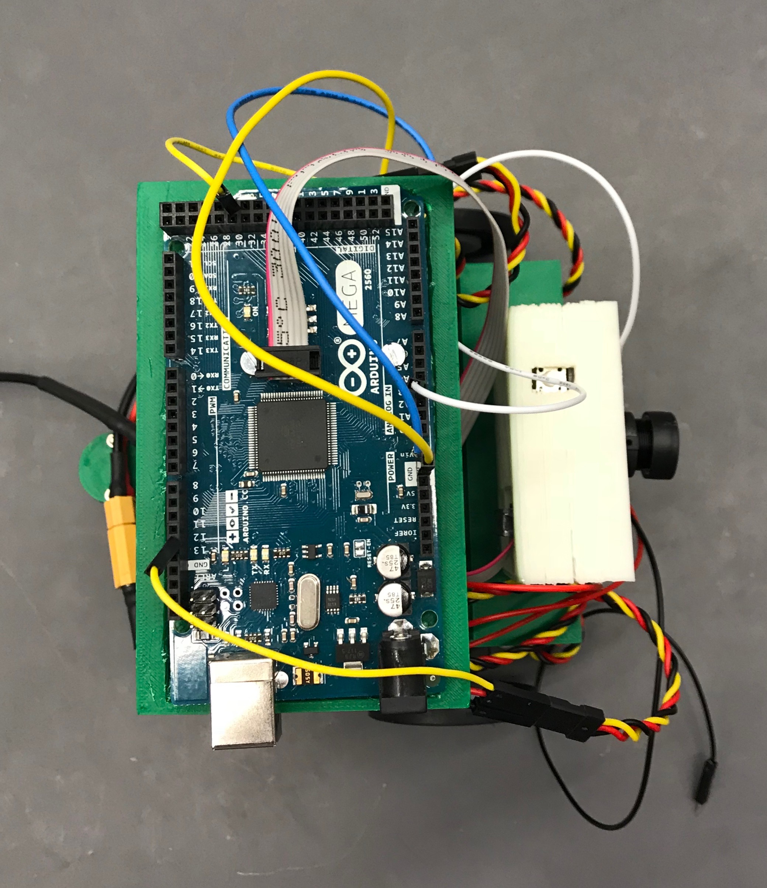

# Week 6 and Spring Break

## Goals
For week six, we had a soft goal of completing milestone 4. Over Spring Break, we had a hard goal of 3D printing a new, robust chassis to replace our underperforming LEGO chassis.

## Milestone 4
With the completion of milestones 5 and 6, we had figured that completing milestone 4 would be a matter of employing our sense_block() function in tandem with the forward-facing sticks in our LEGO chassis to capture blocks and push them out of bounds. 
We implemented a state variable that would correspond to whether or not our robot was carrying a block and has hit a border. If the state is 0, there is no block being carried, and the robot is essentially in "seek" mode.
However, our robot might still actually be carrying a block in this case. This will be explained when we examine the code later. If the state is 1, there is currently a block held between the forward-facing sticks of our robot and we have just hit a border. 
As a visual aide, when the robot was holding a block, an LED would turn on.

The complexity of the problem is reduced because we only essentially only care about two things:
* Do we have a block?
* Have we hit the border? (does state = 1?)

To address the first point, we yet again employed the rand_cruise() function as we did in week 4 to first find a block:

```c++
void rand_cruise(int random_number) {
  random_number = rand() % 4;
  if (random_number == 0) {
    servo_test_1.write(90);
    servo_test_2.write(150);
  }
  else if (random_number == 1) {
    servo_test_1.write(45);
    servo_test_2.write(135);
  }
  else {
    servo_test_1.write(180);
    servo_test_2.write(130);
  }
  delay(250);
}
```

To actually find a block, our robot needs to sense it. This is where our sense_block() function comes into play:

```c++
void sense_blocks(int front_sensor_val) {
  int num_blocks = pixy.getBlocks();
  //Serial.println(num_blocks);
  if ((front_sensor_val >= BLOCK) && (num_blocks >= 1)) {
    Serial.println("Found a block!");
    found_color();
    driving_with_block();
  }
}
```
Using the BLOCK constant as a threshold for our IR sensor, we could determine whether or not a block was directly in front of the IR, and hence directly in front of the robot.
In this instance, utilizing the PixyCam's getBlocks() method was unnecessary, but we thought why not? Now, if the robot has indeed found a block, it would execute the driving_with_block() function.

```c++
void driving_with_block() {
  while (state != 1) {
    found_color();
    drive();
    led_on();
  }
  state = 0;
}
```

While the robot is carrying the block to the border, the state is 0. Upon hitting the border, the found_color() function would do something interesting:

```c++

void found_color() {
  uint16_t r, g, b, c, colorTemp, lux;

  // calling tcs methods to access color, lux, and temperature values
  tcs.getRawData(&r, &g, &b, &c);
  colorTemp = tcs.calculateColorTemperature(r, g, b);
  lux = tcs.calculateLux(r, g, b);

  // White
  if (((colorTemp > 8000) && (colorTemp < 9000)) && ((lux > 95) && (lux < 200))) {
    // white tape
    Serial.println("Reversing!");
    // back up, wait, then rotate
    reverse();
    delay(1000);
    rotate();
    delay(1000);
    state = 1;
    return;
  }
}
```
Notice that if the found_color() function detects that the robot has hit a border, it will change the state to 1. This breaks the while loop of 
the driving_with_block() function, which changes the state back to 0 before exiting. 

In theory, this logic should have done the trick. And to be fair, it did the job most of the time while testing after making adjustments. Unfortunately, our chassis created too many issues and we ultimately were unable to
 complete milestone 4 before the deadline.

## Why a chassis change was necessary
* The back wheel was biasing movement. E.g., if the back wheel was slightly leftward facing, it would cause the robot to veer right even when it was supposed to drive straight
* The structural integrity was suspect. We were consistently repairing our robot to the point where half of the time we were problem-solving and the other half we were repairing the robot.
* While LEGOs are great for proof of concept, they are ultimately inadequate when attempting to make fine-tuned adjustments
* The robot became far too bulky

With these issues in mind, we decided that our next priority was to print out a new chassis over Spring Break. We kept a few things in mind as we designed the model of the chassis:
* Is it modular?
* Is it robust?
* Is it compact?

The first point can be made as an argument for the usefulness of LEGOs, but actually underscores the power of 3D printing. In designing the 3D model, 
we ensured that each piece of the chassis was printed out individually, and *then* superglued together afterward. With serious force, the supergluing can be undone, and 
a change to the chassis can be made without the need to reprint the entire structure. Even if we needed to reprint the entire chassis with modifications, having the chassis body designed with modularity in mind
allows us to separate print jobs and avoid printing errors that can cause hours of time loss. 

The second point was also a major concern. We were worried that superglue might be inadequate to keep the chassis together. But by making parts that fit together properly, and 
by ensuring that each part was thick enough to be strong on its own, supergluing relatively strong parts together actually produces quite a strong 
union of structures. In fact, we were surprised to found out that the robot in its new form can be picked up in virtually any manner and still hold together perfectly.

The final point was a point of minimizing print job times and maximizing the performance of our robot. With weight distribution being an issue that plagues these small servos,
having the structure compact assuages the concern that a part may be weighing the robot down in an unexpected manner. 

With all of this said, the final print came out surprisingly well:

## Pictures of New Chassis
(it reminds me of a tractor or some other kind of farm vehicle?)
|
|:--:|
| **Front View** |
|
|**Side View**|
|
|**Top View**|
|
|**Back View**|

## Next Steps
Our next goal is to wire up the current robot and plan out our block manipulating mechanism. We have a few ideas, ranging from simple, static 
pieces that can "funnel" blocks in, to more complex ideas that employ linear actuators. We will also add a second RGB sensor to ensure that both sides of our robot
can detect the boundary to avoid falling out of bounds.

With the new chassis and hopefully the soon-to-be-created block-capturing mechanism, we hope to race through the next few milestones and narrow down
exaclty how we plan to tackle the competition itself.

## Acknowledgements
Everyone worked on each different part of the milestone 4 attempt. John printed the new chassis over Spring Break.
