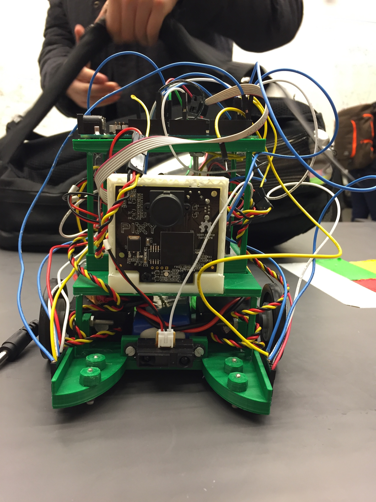
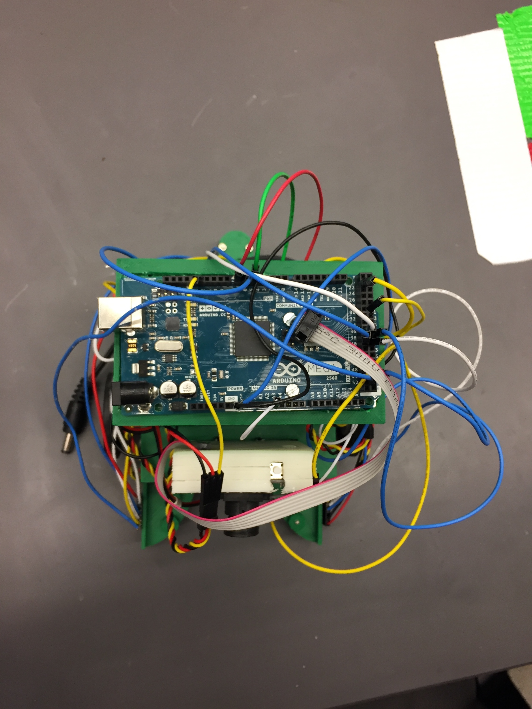
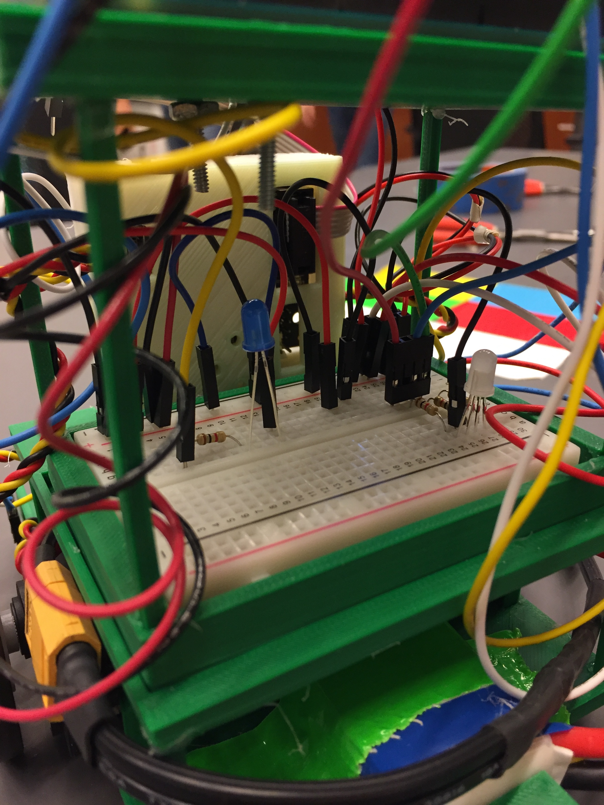

# Week 9

## Goals
Our primary goal for this week was to get our sensors working properly. Our secondary goal was to continue designing a new body to accommodate the additional board for the servos, and possibly implement some block catching mechanism.

## New RGB Sensor Values
Like last week, most of our time this week was spent troubleshooting issues with the additional RGB sensor. We were able to use the SoftI2C color detection code to collect values from both RGB sensors simultaneously, but we are no longer able to calculate color temp, which we previously used to help distinguish between border colors. We got around this by using just the red, green, and blue values to distinguish between tape colors, and the lux value to distinguish between mat and tape. One additional issue we ran into is that the RGB sensors get slightly different values, warranting separate left and right functions for detecting quadrant borders:

```c++
void detect_quadrant_left() {
  uint16_t clear, red, green, blue, lux;
  tcs1.getRawData(&red, &green, &blue, &clear);
  lux = tcs1.calculateLux(red, green, blue);

  if (target_color == 0) {
    drive();
    // Yellow
    Serial.println(lux);
    if (lux > 2000) {
      //Serial.println(lux);
      Serial.println("Got lux");
      //  when lux is above 3000, the sensor is on the tape
      if ((red > blue) && (green > blue) && (red >= 7200) && (red <= 7600)) {
        // yellow tape
        setColor(0, 150, 255);
        target_color = YELLOW;
        Serial.println("Found Yellow!");
      } else if ((red > 9000) && (blue > 9000) && (green > 9000)) {
        // white tape
        Serial.println("Reversing!");
        // back up, wait, then rotate
        reverse();
        delay(1000);
        rotate();
        delay(2000);
        return;
      } else if ((green > red) && (green > blue) && (green >= 2800) && (green <= 3200)) {
        // green tape
        setColor(255, 100, 255);
        target_color = GREEN;
        Serial.println("Found Green!");
      } else if ((red > green) && (red > blue) && (red >= 2500) && (red < 3100)) {
        // red tape
        setColor(0, 255, 255);
        target_color = RED;
        Serial.println("Found Red!");
      } else if ((blue > green) && (blue > red) && (green > red) && (blue > 7300) && (blue < 7700)) {
        // blue tape
        setColor(255, 255, 0);
        target_color = BLUE;
        Serial.println("Found Blue!");
      }
    }
  }
}
void detect_quadrant_right() {
  uint16_t clear, red, green, blue, colorTemp, lux;
  tcs2.getRawData(&red, &green, &blue, &clear);
  lux = tcs2.calculateLux(red, green, blue);
  if (target_color == 0) {
    drive();
    // Yellow
    Serial.println(lux);
    if (lux > 2000) {
      Serial.println("Got lux");
      //  when lux is above 3000, the sensor is on the tape
      if ((red > blue) && (green > blue) && (red >= 5200) && (red <= 5500)) {
        // yellow tape
        setColor(0, 150, 255);
        target_color = YELLOW;
        Serial.println("Found Yellow!");
      } else if ((red > 6700) && (blue > 8100) && (green > 8700)) {
        // white tape
        Serial.println("Reversing!");
        // back up, wait, then rotate
        reverse();
        delay(1000);
        rotate();
        delay(2000);
        return;
      } else if ((green > red) && (green > blue) && (green >= 4600) && (green <= 5100)) {
        // green tape
        setColor(255, 100, 255);
        target_color = GREEN;
        Serial.println("Found Green!");
      } else if ((red > green) && (red > blue) && (red >= 1900) && (red < 2500)) {
        // red tape
        setColor(0, 255, 255);
        target_color = RED;
        Serial.println("Found Red!");
      } else if ((blue > green) && (blue > red) && (green > red) && (blue > 5100) && (blue < 5600)) {
        // blue tape
        setColor(255, 255, 0);
        target_color = BLUE;
        Serial.println("Found Blue!");
      }
    }
  }
}
void border_left() {
  uint16_t clear, red, green, blue, lux;
  Serial.println("established uint16_ts");
  tcs1.getRawData(&red, &green, &blue, &clear);
  Serial.println("got raw data");
  lux = tcs1.calculateLux(red, green, blue);
  Serial.println("got lux");


  if ((red > 9000) && (blue > 9000) && (green > 9000) && (lux > 3000)) {
    // white tape
    Serial.println("Reversing!");
    // back up, wait, then rotate
    reverse();
    delay(1000);
    rotate();
    delay(2000);
    return;
  }
}
void border_right() {
  uint16_t clear, red, green, blue, lux;
  Serial.println("established uint16_ts");
  tcs2.getRawData(&red, &green, &blue, &clear);
  Serial.println("got raw data");
  lux = tcs2.calculateLux(red, green, blue);
  Serial.println("got lux");


  if ((red > 6700) && (blue > 8100) && (green > 8700) && (lux > 2000)) {
    // white tape
    Serial.println("Reversing!");
    // back up, wait, then rotate
    reverse();
    delay(1000);
    rotate();
    delay(2000);
    return;
  }
}
```
In the detect_quadrant methods, we use the red, green, and blue values to decide if the robot is on a quadrant border, and to print to the serial monitor when each color is found. In the border functions, we decide if the robot is on a white border, and if so, initiate a backup behavior. 

## Next Steps
Next week we would like to use these methods to detect the home quadrant, then work on our block finding and capturing mechanisms to continue completing milestones.

## Pictures

|
|:--:|
| *Front View* |
|
| *Top-down view* |
|
| *Breadboard* |


## Acknowledgments
John, Frank, and Amy all worked on updating the code to be compatable with 2 RGB sensors, and getting new values for the quadrant and border detect methods.
